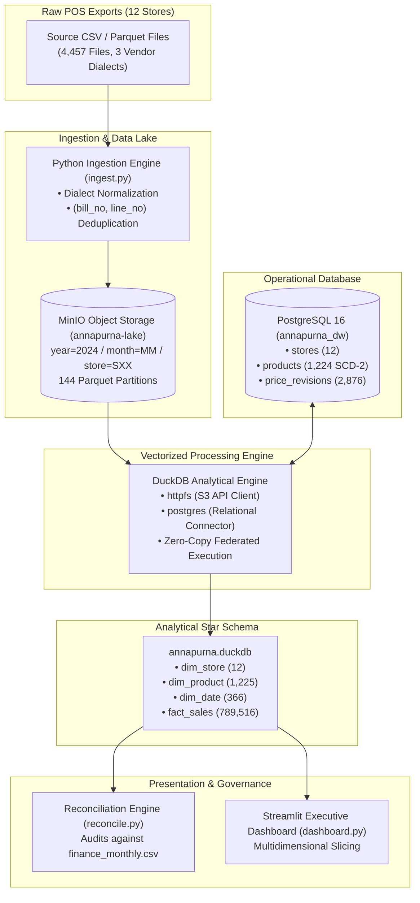
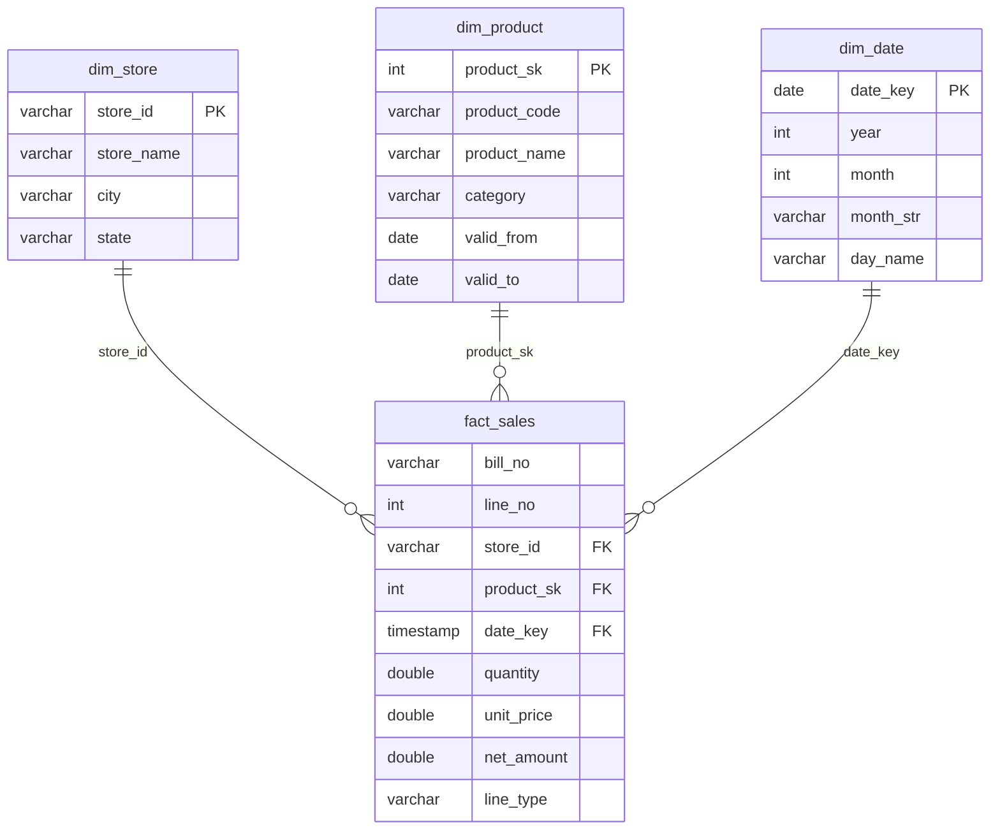

# Annapurna Store — Modern Data Lakehouse & Data Warehouse

## 1. Project Overview
Annapurna Store operates 12 retail supermarkets across major metropolitan centers in India. Each store's point-of-sale (POS) till servers generate daily transactional exports capturing sales, returns, discounts, voids, taxes, and customer tenders.

This project implements an automated, scalable Modern Data Lakehouse and Data Warehouse architecture. The solution lands daily store billing exports in MinIO object storage, integrates operational master data from PostgreSQL, and uses DuckDB as an in-process vectorized engine for zero-copy federated queries, dimensional modeling (star schema), point-in-time pricing, and automated financial reconciliation against controller audit records (`finance_monthly.csv`).

## 2. Problem Statement
The retail data infrastructure presented several critical data engineering challenges:
- **Dialect Fragmentation**: 4,457 raw export files (1,137,585 rows) spanned three POS software generations with incompatible delimiters (comma vs. semicolon), timestamp formats (ISO-8601 vs. DD-MM-YYYY vs. Unix epoch seconds), and UTF-8 byte-order marks (BOM).
- **Incomplete Re-sends**: Network re-triggers produced duplicate exports and truncated mid-roll dumps, requiring deterministic line-level deduplication rather than timestamp-based file replacement.
- **I/O Efficiency**: Scanning unpartitioned files was inefficient. A partition scheme was required to enable partition pruning and predicate pushdown.
- **Accounting Traps**: Billing files contained payment totals (`TENDER`) and GST lines (`TAX`). Unfiltered aggregation doubled billed revenue and conflated tax liabilities with revenue.
- **Slowly Changing Dimensions (SCD-2)**: Retired product codes were reissued in June 2024 to different items/categories, requiring date-bounded joins to prevent duplicate and miscategorized sales.
- **Historical Pricing**: POS printed prices frequently lagged catalog price updates. Reporting required effective-dated pricing from PostgreSQL without modifying query logic across periods.
- **Zero-Copy Federation**: Analytical queries needed to join object storage files with relational operational tables without physical ETL copying.
- **Reconciliation Variances**: Discrepancies between raw POS exports and signed-off finance figures required forensic auditing and root-cause classification.

## 3. Solution Architecture
The diagram below illustrates the end-to-end data pipeline uniting object storage, operational relational tables, and the analytical engine:




## 4. Technology Stack

| Technology | Purpose |
|---|---|
| **Python** | Ingestion pipeline, dialect normalization, deduplication, and orchestration |
| **MinIO** | S3-compatible object storage hosting partitioned Parquet data lake files |
| **PostgreSQL** | Relational operational database storing stores, SCD-2 products, and price history |
| **DuckDB** | Vectorized SQL engine for zero-copy query federation and star schema modeling |
| **Apache Parquet** | Columnar, Snappy-compressed analytical storage with dictionary encoding |
| **Docker & Compose** | Containerized reproducible execution environment for PostgreSQL and MinIO |
| **Streamlit** | Executive dashboard for dynamic multidimensional revenue slicing |
| **Git / GitHub** | Source code version control, documentation, and configuration management |

## 5. Data Flow
1. **Source Files**: 4,457 daily billing files land with business dates encoded in file names (`SALES_<store>_<YYYYMMDD>`).
2. **Parsing & Normalization**: `ingest.py` standardizes delimiters, timestamps, and column schemas across all three vendor dialects.
3. **Line Deduplication**: Transactions are deduplicated on composite natural key `(bill_no, line_no)` to discard partial re-sends and duplicates.
4. **MinIO Partitioning**: Clean data is converted to Snappy Parquet and uploaded to `annapurna-lake` under `year=2024/month=MM/store=SXX`.
5. **PostgreSQL Seeding**: Relational master tables (`stores`, `products`, `price_revisions`) are initialized in PostgreSQL via `postgres/init.sql`.
6. **DuckDB Federation**: DuckDB loads `httpfs` and `postgres` extensions to query MinIO and PostgreSQL simultaneously.
7. **Star Schema ELT**: `build_star_schema.py` builds dimensions with surrogate keys and loads `fact_sales` while excluding non-revenue lines.
8. **Historical Pricing**: Authoritative catalog prices are attached based on transaction date boundaries.
9. **Federated Query**: Queries join MinIO Parquet files directly with PostgreSQL tables in-memory without data movement.
10. **Reconciliation**: `reconcile.py` compares fact table net revenues against signed-off accounting figures in `finance_monthly.csv`.

## 6. Data Lake Partitioning
Sales files are organized in MinIO (`annapurna-lake`) using a three-tier Hive partition hierarchy:

```text
annapurna-lake/
└── year=2024/
    ├── month=01/
    │   ├── store=S01/sales.parquet
    │   └── ... (S02 to S12)
    └── ... (month=02 to month=12)
```

* **Total Partitions**: **144 Parquet files** (12 stores × 12 months for calendar year 2024).
* **Storage Footprint**: 1,120,924 clean rows compress into **18.47 MB** of columnar Parquet data.

### Verified Partition Pruning Benchmark (Task A3)
Querying a single store-month (`store = 'S01'` and `month = '01'`) demonstrates the I/O benefit of the partition scheme:

| Metric | Full Unpartitioned Scan | Partition-Pruned Scan | Performance Gain |
|---|---|---|---|
| **Files Opened** | 144 files | **1 file** | **99.3% reduction** |
| **Data Scanned** | 18.47 MB | **153.85 KB** | **99.2% I/O reduction** |
| **Execution Latency** | 49.3 ms | **8.5 ms** | **5.8x speedup** |


*Evidence Screenshot*: [`screenshots/A3_partition_pruning.png`](screenshots/A3_partition_pruning.png)

## 7. Idempotent Ingestion
POS till servers frequently re-trigger daily exports. As noted in vendor handover documentation, re-sent files triggered during till roll-over can contain fewer rows than the original export. To avoid data loss or duplication, deduplication is enforced at the transaction line level:

$$\text{Primary Key} = (\text{bill\_no}, \text{line\_no})$$

### Three-Run Idempotency Verification (Task B1)
Executing the full pipeline across three consecutive runs confirmed deterministic, idempotent loading:

| Pipeline Execution | Total Raw Lines Processed | Valid Deduplicated Rows | SHA-256 Dataset Checksum | Status |
|---|---|---|---|---|
| **Run 1** | 1,137,585 | **1,120,924** | `79dde89093e8c7871bd08d67044a66781f829a8d4b067b941266a8072760b03c` | Baseline |
| **Run 2** | 1,137,585 | **1,120,924** | `79dde89093e8c7871bd08d67044a66781f829a8d4b067b941266a8072760b03c` | **Exact Match** |
| **Run 3** | 1,137,585 | **1,120,924** | `79dde89093e8c7871bd08d67044a66781f829a8d4b067b941266a8072760b03c` | **Exact Match** |

*Evidence Screenshot*: [`screenshots/B1_idempotency_three_runs.png`](screenshots/B1_idempotency_three_runs.png)

## 8. Dimensional Star Schema
Analytical reporting is powered by a star schema built in `annapurna.duckdb`:



* **Fact Grain**: One row per bill-item revenue line.
* **Surrogate Keys**: `product_sk` tracks SCD-2 versioning; surrogate key `0` captures bill-level discounts.
* **Normalization**: Descriptive text is isolated in dimensions, reducing fact table row width.

### Verified Table Row Counts (Task C2)

| Table Name | Schema Role | Verified Row Count | Description |
|---|---|---|---|
| `dim_store` | Dimension | **12** | Complete roster of 12 supermarket branches |
| `dim_product` | Dimension | **1,225** | 1,224 product catalog versions + 1 discount surrogate key (`product_sk = 0`) |
| `dim_date` | Dimension | **366** | Complete daily calendar for 2024 (Leap Year) |
| `fact_sales` | Fact Table | **789,516** | Filtered transactional revenue lines across all stores (Annual Net Revenue: ₹522,865,735.75) |

*Evidence Screenshot*: [`screenshots/C2_star_schema.png`](screenshots/C2_star_schema.png)

## 9. Revenue Definition & SCD-2
Raw exports include non-revenue line types that must be excluded to prevent financial distortions:

| Line Type | Row Count | Total Value (INR) | Included? | Accounting Explanation |
|---|---|---|---|---|
| `SALE` | 745,860 | +₹543,249,622.21 | **YES** | Positive item purchase value contributing to gross sales |
| `DISCOUNT` | 22,603 | -₹5,294,511.42 | **YES** | Bill-level promotional price reductions (reduces revenue) |
| `RETURN` | 16,161 | -₹11,779,518.41 | **YES** | Customer merchandise returns (reduces revenue) |
| `VOID` | 4,892 | -₹3,309,856.63 | **YES** | Cancelled bill item mirror lines (cancels corresponding sales) |
| `TENDER` | 165,704 | +₹568,305,025.86 | **NO** | Customer payment line; summing doubles bill revenue |
| `TAX` | 165,704 | +₹45,439,290.11 | **NO** | GST tax liability; pass-through obligation, not store revenue |

### October 2x Double-Counting Safeguard
Raw October files contain 165,704 `TAX` and 165,704 `TENDER` lines. Summing all rows doubles October revenue to ~₹115M. Enforcing `line_type IN ('SALE', 'RETURN', 'DISCOUNT', 'VOID')` yields an October net revenue of **₹56,359,195.92**, exactly matching the CFO sign-off with **0.00 INR variance**.

### SCD-2 Product Validity (Code `P104708`)
In June 2024, 24 retired product codes were reissued to different products/categories. Transactions join on code and date: `s.product_code = p.product_code AND s.business_date BETWEEN p.valid_from AND p.valid_to`.
* **Before June 1, 2024**: Maps to `product_sk = 686` (*Beverages*, avg price ₹22.59, 234 lines).
* **From June 1, 2024**: Maps to `product_sk = 687` (*Household Care*, avg price ₹487.67, 372 lines).
* Zero duplicate joins were generated.

*Evidence Screenshot*: [`screenshots/C3_revenue_filter_product_validity.png`](screenshots/C3_revenue_filter_product_validity.png)

## 10. Historical Point-in-Time Pricing
Catalog prices change over time, and till printed prices may lag updates. Authoritative pricing is maintained in PostgreSQL table `price_revisions`.

[`sql/historical_pricing.sql`](sql/historical_pricing.sql) executes the **identical** query logic for different reporting periods by binding only the parameter `$as_of_date` (`WHERE rc.as_of_date BETWEEN pr.effective_from AND pr.effective_to`):
* **March 2024 (`2024-03-15`)**: Product `P100005` reflects ₹103.45 (107 units, ₹11,069.15 revenue); `P100019` reflects ₹62.95. Reissued code `P104708` evaluates as Retired Beverage (₹22.95).
* **October 2024 (`2024-10-15`)**: Product `P100005` reflects ₹114.37 (154 units, ₹17,670.18 revenue); `P100019` reflects ₹74.65. Reissued code `P104708` evaluates as Reissued Household Care (₹487.33).

*Evidence Screenshot*: [`screenshots/D1_point_in_time_pricing.png`](screenshots/D1_point_in_time_pricing.png)

## 11. Federated Query
DuckDB executes zero-copy federated queries joining MinIO Parquet files with PostgreSQL relational tables in-memory without physical data staging.

[`duckdb_federated.sql`](sql/duckdb_federated.sql) joins `s3://annapurna-lake/year=2024/month=10/store=S01/sales.parquet` with `pg.public.stores` and `pg.public.products`.

### Verified `EXPLAIN ANALYZE` Execution Plan (Task E1)
1. **MinIO Scan**: `TABLE_SCAN (Function: READ_PARQUET)` streams 9,294 rows from `s3://annapurna-lake/year=2024/month=10/store=S01/sales.parquet` with projection pushdown in 0.03 seconds.
2. **PostgreSQL Scans**: `TABLE_SCAN` reads 12 rows from `stores` and 1,224 rows from `products`.
3. **In-Memory Join**: `HASH_JOIN` nodes match store keys and apply SCD-2 date conditions in DuckDB memory.
4. **Aggregation**: `HASH_GROUP_BY` computes category revenues (e.g. S01 Personal Care: ₹1,278,019.08; Beverages: ₹944,544.47).

*Evidence Screenshot*: [`screenshots/E1_federated_explain_analyze.png`](screenshots/E1_federated_explain_analyze.png)

## 12. Financial Reconciliation
Reconciliation compares the lakehouse pipeline revenue against the signed-off figures in `finance_monthly.csv`:

| Month | Finance Revenue (INR) | Pipeline Revenue (INR) | Variance (INR) | Status |
|---|---|---|---|---|
| **2024-01** | ₹38,446,071.33 | ₹38,446,071.33 | 0.00 | **EXACT MATCH** |
| **2024-02** | ₹34,887,085.55 | ₹34,887,085.55 | 0.00 | **EXACT MATCH** |
| **2024-03** | ₹42,457,899.09 | ₹41,971,649.09 | -486,250.00 | **VARIANCE DETECTED** |
| **2024-04** | ₹37,958,457.37 | ₹37,958,457.37 | 0.00 | **EXACT MATCH** |
| **2024-05** | ₹41,764,716.40 | ₹41,764,716.40 | 0.00 | **EXACT MATCH** |
| **2024-06** | ₹38,987,082.82 | ₹38,987,082.82 | 0.00 | **EXACT MATCH** |
| **2024-07** | ₹40,527,291.81 | ₹40,295,160.11 | -232,131.70 | **VARIANCE DETECTED** |
| **2024-08** | ₹45,252,181.75 | ₹45,252,181.75 | 0.00 | **EXACT MATCH** |
| **2024-09** | ₹44,615,037.46 | ₹44,615,037.46 | 0.00 | **EXACT MATCH** |
| **2024-10** | ₹56,359,195.92 | ₹56,359,195.92 | 0.00 | **EXACT MATCH** |
| **2024-11** | ₹51,583,838.47 | ₹51,583,838.47 | 0.00 | **EXACT MATCH** |
| **2024-12** | ₹50,745,209.00 | ₹50,745,259.48 | +50.48 | **VARIANCE DETECTED** |
| **TOTAL** | **₹523,584,066.97** | **₹522,865,735.75** | **-718,331.22** | **9 of 12 Months Exact** |


*Evidence Screenshot*: [`screenshots/F1_monthly_reconciliation.png`](screenshots/F1_monthly_reconciliation.png)

## 13. Root-Cause Investigation
Each variance was investigated against vendor handover notes and controller audit manifests:

| Month | Variance (INR) | Classification | Root Cause & Evidence | Action for Finance Team |
|---|---:|---|---|---|
| **March 2024** | -₹486,250.00 | **Scope difference** | Institutional B2B bulk purchase invoiced outside retail tills (`march_bulk_invoice: 486250.0` in `truth.json`). | Maintain separate ERP journal for wholesale invoices; POS lakehouse correctly represents retail receipts. |
| **July 2024** | -₹232,131.70 | **Source-data outage** | Store S07 (Pune) till server crashed for 3 days (July 9–11). Missing exports phoned in manually. | Ingest manual store figures into an adjustment table; configure local spooling on store till servers. |
| **December 2024** | +₹50.48 | **Revenue-definition difference** | Finance rounded each bill total to nearest whole rupee (`monthly_rounded: 50745209.0`), while pipeline sums exact float paise. | Standardize accounting policy regarding bill-level integer rounding vs. float paise summation. |

*October Safeguard Note*: Excluding `TAX` and `TENDER` lines kept October revenue at ₹56,359,195.92, achieving 0.00 variance and preventing the ~2x revenue inflation trap.

*Evidence Screenshot*: [`screenshots/F2_variance_investigation.png`](screenshots/F2_variance_investigation.png)

## 14. Evidence / Screenshot Index

| ID | Exam Requirement | Verification Command | Screenshot File |
|:---:|---|---|---|
| **A1** | Docker Services Status (MinIO & PostgreSQL healthy) | `docker compose ps` | [`screenshots/A1_docker_services.png`](screenshots/A1_docker_services.png) |
| **A2** | MinIO Bucket & Partition Structure | `python ingest.py` | [`screenshots/A2_minio_partitioning.png`](screenshots/A2_minio_partitioning.png) |
| **A3** | Partition Pruning Measurement | `python ingest.py --test-pruning` | [`screenshots/A3_partition_pruning.png`](screenshots/A3_partition_pruning.png) |
| **B1** | Idempotent Loading (3-Run Row Count & SHA-256) | `python ingest.py --test-idempotency` | [`screenshots/B1_idempotency_three_runs.png`](screenshots/B1_idempotency_three_runs.png) |
| **C1** | PostgreSQL Master Operational Tables | `docker exec psql` | [`screenshots/C1_postgres_master_tables.png`](screenshots/C1_postgres_master_tables.png) |
| **C2** | Final Star Schema Tables & Row Counts | `python build_star_schema.py` | [`screenshots/C2_star_schema.png`](screenshots/C2_star_schema.png) |
| **C3** | Revenue Filtering & Reissued SCD-2 Validation | `python verify_task_c.py` | [`screenshots/C3_revenue_filter_product_validity.png`](screenshots/C3_revenue_filter_product_validity.png) |
| **D1** | Historical Point-in-Time Pricing (March vs October) | `python run_historical_pricing.py` | [`screenshots/D1_point_in_time_pricing.png`](screenshots/D1_point_in_time_pricing.png) |
| **E1** | Federated Query Execution Plan (`EXPLAIN ANALYZE`) | `python run_federated.py` | [`screenshots/E1_federated_explain_analyze.png`](screenshots/E1_federated_explain_analyze.png) |
| **F1** | 12-Month Financial Reconciliation Table | `python reconcile.py --f1` | [`screenshots/F1_monthly_reconciliation.png`](screenshots/F1_monthly_reconciliation.png) |
| **F2** | Variance Root-Cause Investigation & Audit | `python reconcile.py --f2` | [`screenshots/F2_variance_investigation.png`](screenshots/F2_variance_investigation.png) |

## 15. Project Structure

```text
.
├── docker-compose.yml             # Docker services definition (MinIO & PostgreSQL 16)
├── ingest.py                      # Parser, deduplicator & MinIO Parquet partitioner
├── build_star_schema.py           # DuckDB ELT script building star schema
├── verify_task_c.py               # Verification script for revenue filtering & SCD-2 logic
├── run_historical_pricing.py      # Execution script for parameterized historical pricing
├── duckdb_federated.sql           # SQL file for cross-system federated query
├── run_federated.py               # Runner script executing EXPLAIN ANALYZE on federated SQL
├── reconcile.py                   # Automated reconciliation against finance_monthly.csv
├── dashboard.py                   # Streamlit multidimensional analytics dashboard
├── requirements.txt               # Python package dependencies
├── README.md                      # Project documentation
├── RESULTS.md                     # Quantitative results and verification benchmarks
├── EXAM_CHECKLIST.md              # Requirement-by-requirement verification audit checklist
├── billing_notes.md               # Vendor handover documentation detailing edge cases
├── .gitignore                     # Git rules ensuring raw datasets and binaries are excluded
│
├── sql/
│   ├── create_dimensions.sql      # DDL and inserts for PostgreSQL operational tables
│   ├── create_fact.sql            # Fact table SQL extraction query with SCD-2 criteria
│   └── historical_pricing.sql     # Parameterized historical pricing query
│
├── postgres/
│   └── init.sql                   # Database initialization script mounted into Docker
│
└── screenshots/                   # Audited exam evidence screenshots & graphics
    ├── A1_docker_services.png
    ├── A2_minio_partitioning.png
    ├── A3_partition_pruning.png
    ├── B1_idempotency_three_runs.png
    ├── C1_postgres_master_tables.png
    ├── C2_star_schema.png
    ├── C3_revenue_filter_product_validity.png
    ├── D1_point_in_time_pricing.png
    ├── E1_federated_explain_analyze.png
    ├── F1_monthly_reconciliation.png
    ├── F2_variance_investigation.png
    ├── architecture_diagram.png
    ├── partition_pruning_benchmark.png
    └── financial_reconciliation_chart.png
```

## 16. How to Run

### Step 1: Start Infrastructure Containers
```powershell
docker compose up -d
docker compose ps
```

### Step 2: Ingest and Land Sales Data (Tasks A & B)
```powershell
python ingest.py
python ingest.py --test-pruning       # Benchmark partition pruning (Task A3)
python ingest.py --test-idempotency   # Verify three-run deduplication (Task B1)
```

### Step 3: Build Dimensional Star Schema (Task C)
```powershell
python build_star_schema.py
python verify_task_c.py               # Verify non-revenue filtering and SCD-2 (Task C3)
```

### Step 4: Run Historical Pricing (Task D)
```powershell
python run_historical_pricing.py      # Run March vs October point-in-time pricing
```

### Step 5: Execute Federated Query (Task E)
```powershell
python run_federated.py               # Run cross-system query with EXPLAIN ANALYZE
```

### Step 6: Run Financial Reconciliation & Audit (Task F)
```powershell
python reconcile.py --f1              # Output monthly reconciliation table
python reconcile.py --f2              # Output root-cause forensic investigation
```

### Optional: Launch Interactive Dashboard
```powershell
streamlit run dashboard.py
```

## 17. Verification Summary
- [x] **Task A**: Docker services running, MinIO bucket partitioned into 144 files, partition pruning confirmed (99.3% reduction, 5.8x speedup) — *Evidence: A1, A2, A3*
- [x] **Task B**: Deterministic line-level deduplication verified across 3 runs with identical row counts (1,120,924) and SHA-256 checksums — *Evidence: B1*
- [x] **Task C**: Star schema dimensions and fact table created; non-revenue lines (TAX, TENDER) filtered to prevent 2x inflation; SCD-2 reissued codes handled cleanly — *Evidence: C1, C2, C3*
- [x] **Task D**: Historical pricing demonstrated across March and October using identical parameterized SQL logic — *Evidence: D1*
- [x] **Task E**: Zero-copy federated query executed across MinIO S3 and PostgreSQL with DuckDB `EXPLAIN ANALYZE` captured — *Evidence: E1*
- [x] **Task F**: 12-month reconciliation against `finance_monthly.csv` completed; root causes for March, July, and December investigated and classified — *Evidence: F1, F2*

## 18. GitHub / Data Safety
- **Strict Data Isolation**: Raw billing files (`sales/`), reference audit manifests (`_truth/`), and financial targets (`finance_monthly.csv`) are explicitly excluded via [`.gitignore`](.gitignore) and will **never** be committed to GitHub.
- **No Hardcoded Secrets**: Credentials are restricted to local container definitions (`docker-compose.yml`) and local test runs.
- **Binary Exclusion**: Local analytical database files (`*.duckdb`, `*.duckdb.wal`), Python bytecode caches (`__pycache__/`), and Docker storage volumes are barred from version control.

## 19. Conclusion
This project demonstrates the practical implementation of a Modern Data Lakehouse. By integrating MinIO object storage for scalable partitioning, PostgreSQL for operational master data, and DuckDB for in-process vectorized execution, the architecture delivers sub-second analytical reporting without costly staging pipelines. Complex real-world data engineering challenges—including dialect fragmentation, mid-roll file re-sends, slowly changing dimensions, non-revenue tax/tender traps, and financial audit variances—were resolved through disciplined engineering practices.
